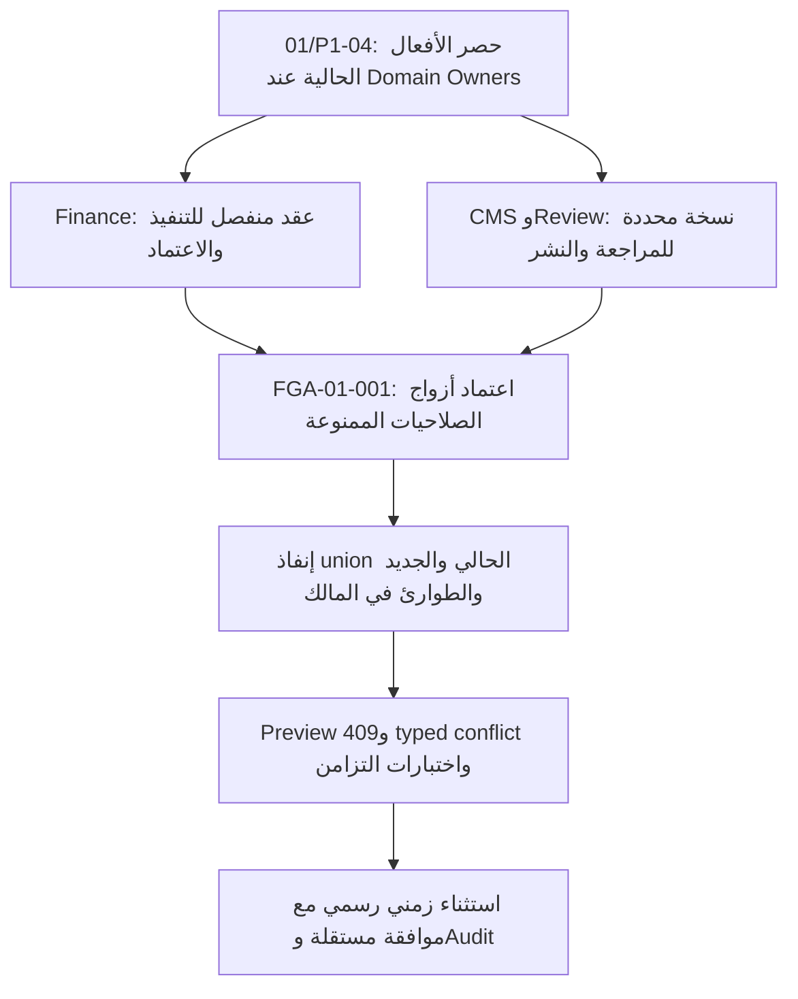

# القسم 01 — سجل التنفيذ وإعادة التحقق

هذا سجل تنفيذ لمهام القسم 01 في **MANARATAK_ADMIN_REVIEW_CODEX.md**، وليس خطة إصلاحات بديلة. يحتفظ بالمعرفات الأصلية؛ `01/` أدناه يحدد القسم فقط.

## مرجع التنفيذ وحدوده

- المستودع: `wegdangamil2022-oss/MANARATAK-First-`.
- الفرع: `codex/section-01-iam-rbac`.
- HEAD ومرجع `main` البعيد عند إعادة الفحص: `bac768e7fcd76e5702697760669449b39b0e2cca`؛ تأكد ذلك باستخدام `git ls-remote origin refs/heads/main`، بتاريخ 2026-10-08.
- المرجع المعتمد: المرفق الأصلي `1-MANARATAK_ADMIN_REVIEW_CODEX.md`، SHA-256: `9de7c781eb82cd490fc85386267d7e9e3fe2b2028803f9ecd0351531e2cd11fc`؛ لم يُعدّل المرفق.
- المهام الأصلية لهذا القسم: **2 P0 + 14 P1**؛ الإضافة الوظيفية: **FGA-01-001**. لا يشمل هذا العدد الأقسام الأخرى.
- التغييرات محلية، ولم تُدفع إلى GitHub. لم تُشغّل migration أو seed أو reset أو backfill أو عمليات مالية أو إشعارات أو أوامر كتابة إلى قاعدة بيانات فعلية.
- `SOURCE_IMPLEMENTED` يعني وجود الإصلاح والأدلة المصدرية المناسبة، ولا يعني `CLOSED` أو جاهزية الإنتاج. شروط التشغيل أدناه ما زالت `RUNTIME_PENDING`.

## المهام الأصلية والنتيجة

| المعرف الأصلي | نتيجة التحقق الأصلية     | التنفيذ الحالي والأدلة الأساسية                                                                                                                                                                                                                                                                | الإغلاق                                          |
| ------------- | ------------------------ | ---------------------------------------------------------------------------------------------------------------------------------------------------------------------------------------------------------------------------------------------------------------------------------------------- | ------------------------------------------------ |
| 01/P0-01      | CONFIRMED_FUNCTIONAL_GAP | `IdentityAdminPage.tsx`: قائمة وتفاصيل وإنشاء هوية وتعديل Profile/Contact وإجراءات دورة الحياة عبر Identity owner APIs؛ لا يمنح أدوارًا أو توثيق بريد يدويًا.                                                                                                                                  | SOURCE_IMPLEMENTED / RUNTIME_PENDING             |
| 01/P0-02      | CONFIRMED_DEFECT         | إضافة `admin:identities:manage` إلى `ADMIN_SECTIONS`، مسار `/identities` وقائمة مستقلة؛ اختبارات مستخدم identity-only تمنع الوصول الضمني إلى Authorization.                                                                                                                                    | SOURCE_IMPLEMENTED                               |
| 01/P1-01      | CONFIRMED_FUNCTIONAL_GAP | جرد الهوية بالاسم والبريد وحالة الهوية والحساب والتوثيق والأدوار وآخر تغيير مسجل. الفلاتر والعدّ قبل التصفح في owner repositories. فلتر الدور يستعمل ID مرجعيًا من role-options؛ فلتر «دور إداري مسند» لا يدعي أنه إثبات وصول فعلي. Latest access projection يقرأ Audit owner دون نسخ السجلات. | SOURCE_IMPLEMENTED / RUNTIME_PENDING             |
| 01/P1-02      | PARTIALLY_IMPLEMENTED    | `AuthorizationIdentityPicker.tsx`: بحث خادمي مؤجل، cursor، Active + verified + account Active؛ فحص أهلية المستفيد والمعتمد في API أيضًا، لا يعتمد على UI.                                                                                                                                      | SOURCE_IMPLEMENTED / RUNTIME_PENDING             |
| 01/P1-03      | PARTIALLY_IMPLEMENTED    | كتالوج مشترك ثنائي اللغة يحوي **28** رمزًا موجودًا: domain/action/risk/descriptions وdelegability. API يعرض فقط الصلاحيات التي يستطيع المنفذ تفويضها؛ لا استحداث صلاحيات وهمية.                                                                                                                | SOURCE_IMPLEMENTED                               |
| 01/P1-04      | PROPOSED_ENHANCEMENT     | عقد التفصيل المرحلي أدناه؛ لم تُستبدل `manage` عبر جميع المجالات أو تتغير guards سليمة في هذا الإصلاح.                                                                                                                                                                                         | ARCHITECTURE_DEPENDENCY؛ ليس CLOSED              |
| 01/P1-05      | PARTIALLY_IMPLEMENTED    | تحرير الدور المخصص، الوصف والصلاحيات وpolicy references وعدد التعيينات وmetadata، نسخ إلى مسودة تحفظ قيود السياسة، retirement، حماية system/canonical IDs وCAS. لا يوجد hard-delete API؛ توجد حماية owner-side من التعيينات وتاريخ emergency قبل الحذف الداخلي.                                | SOURCE_IMPLEMENTED / RUNTIME_PENDING             |
| 01/P1-06      | CONFIRMED_DEFECT         | أسماء NFKC + trim + whitespace collapse + lowercase؛ name advisory lock وcollision query في المعاملة، وCAS للتعديل. اختبارات تنافس in-memory وconditional Prisma calls. لا ادعاء بإثبات PostgreSQL فعلي أو بوجود unique constraint جديد.                                                       | SOURCE_IMPLEMENTED / DB_PROOF_PENDING            |
| 01/P1-07      | CONFIRMED_FUNCTIONAL_GAP | `ManagePoliciesUseCase` مع كتابة owner/audit/outbox في المعاملة، typed TIME/IP وweekday/timezone validation، preview دون منح وصول، إنشاء/تعديل/سحب، attach/detach عبر Role CAS. Retirement يحتفظ بالمرجع ويمنع الوصول المعتمد عليه؛ لا hard-delete API.                                        | SOURCE_IMPLEMENTED / RUNTIME_PENDING             |
| 01/P1-08      | CONFIRMED_FUNCTIONAL_GAP | Effective access API يستخدم evaluator الحالي ووقت/IP الطلب، والتحقق من أهلية المصادقة المعتمد، ويشرح الأدوار والسياسات ومصدر ASSIGNMENT/EMERGENCY؛ لا يقبل سياقًا مزورًا من query. حماية identity/resource/action من override داخل evaluator.                                                  | SOURCE_IMPLEMENTED / RUNTIME_PENDING             |
| 01/P1-09      | PARTIALLY_IMPLEMENTED    | chooser للمعتمد يبحث في Active/verified/authorized ويستبعد المنفذ. سياق الموافقة يظهر للعمليات عالية المخاطر، مع reason/ticket والتحقق الخلفي؛ تغيير السياسات يتطلب موافقة مستقلة لأنه يؤثر على أدوار مرتبطة. لا تُطلب موافقة ثانية لتعديل دور STANDARD بلا تغيير سياسة.                       | SOURCE_IMPLEMENTED / RUNTIME_PENDING             |
| 01/P1-10      | PARTIALLY_IMPLEMENTED    | Activity projection يقرأ `AUTHORIZATION_MUTATION` للنجاح و`AUTHORIZATION` للرفض من Audit owner، لا آخر 100 عملية مجمعة. فلاتر actor/target/action/date وcursor؛ رابط Audit Center بفلتر category.                                                                                              | SOURCE_IMPLEMENTED / RUNTIME_PENDING             |
| 01/P1-11      | CONFIRMED_DEFECT         | keyset cursor للهويات والأدوار والتعيينات والسياسات والوصول الطارئ والتدقيق، مع استعلامات محدودة. لا تستعمل endpoints الإدارية `listAll()`. بقيت طرق legacy الداخلية وoffset القديم للتوافق؛ الواجهات الجديدة تستخدم cursor.                                                                   | SOURCE_IMPLEMENTED / RUNTIME_PENDING             |
| 01/P1-12      | CONFIRMED_DEFECT         | نقل النصوص إلى AR/EN dictionaries واتجاه RTL/LTR؛ اختبارات عرض الصفحة باللغتين وعدم تسرب مفاتيح الترجمة أو النص العربي إلى صفحة الإنجليزية. ترجمة Audit Center العامة تخص القسم 02؛ التعديل المرتبط هنا يهيئ filter فقط.                                                                       | SOURCE_IMPLEMENTED؛ browser verification pending |
| 01/P1-13      | CONFIRMED_DEFECT         | `PrismaRoleRepository` و`PrismaPolicyRepository`: يتجاهل delete حالة P2025 فقط؛ أخطاء FK/transaction/network وغيرها تمرّر.                                                                                                                                                                     | SOURCE_IMPLEMENTED                               |
| 01/P1-14      | CONFIRMED_DEFECT         | `AuthorizationErrorResponse`: Problem Details، 400/401/403/404/409/503 و500 آمن؛ منع عرض SQL أو تفاصيل الاتصال.                                                                                                                                                                                | SOURCE_IMPLEMENTED / integration pending         |
| FGA-01-001    | PROPOSED_ENHANCEMENT     | لم توجد مصفوفة أزواج صلاحيات ممنوعة قابلة للتنفيذ في المصادر المفحوصة. **أكد المستخدم عدم وجودها ووجّه لتوثيق الاعتمادية على تفصيل الصلاحيات**. لا حظر افتراضي لأدوار سليمة، ولا مساواة Maker-Checker بإنفاذ SoD union.                                                                        | DEPENDENCY_DOCUMENTED بقرار المستخدم؛ ليس CLOSED |

## قرارات السلامة

1. Identity lifecycle writes تبقى عند Identity owner؛ role/policy/assignment/emergency writes عند Authorization owner. Identity directory يقرأ role IDs/names عبر منافذ المالك، ولا ينشئ مصدر حقيقة جديدًا للصلاحيات.
2. القيم الحساسة وwildcards وصلاحيات إدارة Authorization/Identity/Credentials غير قابلة للتفويض من هذا المسار. التعديل يراجع سلطة المنفذ على الصلاحيات القديمة والجديدة؛ إزالة قيد سياسة ليست استثناءً من الموافقة المستقلة.
3. role retirement يسحب الصلاحيات ويبقي ID والتعيينات التاريخية. policy retirement يمنع المسار المعتمد عليه بدل إزالة القيد وزيادة الامتيازات. النسخ يحتفظ بقيود السياسات.
4. تحديث الدور والسياسة يقارن `updatedAt` في قاعدة البيانات ويزيده حتى في المللي ثانية نفسها. هذا ليس تغيير schema أو migration. PostgreSQL name-lock وnormalization لم يُختبرا على قاعدة فعلية.
5. حذف الدور الداخلي المحمي ومنح emergency يشتركان في reference advisory lock؛ FK Restrict يحمي تعيينات الأدوار. لا تعرض الواجهة أو API أمر hard-delete للدور أو السياسة.
6. فشل تحميل read capability أو backend لا يتحول إلى بيانات وهمية. القوائم المحدودة تسمي الصفحة المحملة ولا تعرضها باعتبارها المنصة كاملة.
7. صلاحيات viewer ليست بيانات جلسة للمستخدم المستهدف: النتيجة تخص request time/IP وتطبق أهلية المصادقة المعتمدة. توجد حاجة لإثبات التشغيل مع credentials وsessions وقواعد السياسة الفعلية قبل إغلاق القبول.
8. Activity read model لا ينسخ قاعدة Audit أو يستبدل صلاحيات Audit Center؛ الرابط الكامل يتطلب `admin:audit:manage`.
9. إعادة طلب تعيين الدور نفسه تعيد معرّف التعيين المحفوظ و`replayed: true` دون كتابة أو success audit إضافي؛ لا تدّعي حفظ معرّف إعادة الطلب. تغيير identity/role لتعيين موجود يظل ممنوعًا. هذا إثبات لإعادة الطلب المتتابعة؛ ليس إثباتًا لتزامن معاملتين فعليتين.

### فحص السياسة المشتركة داخل المعاملة

إنشاء سياسة أو تعديلها أو سحبها يعيد فحص صلاحيات **جميع** الأدوار المرتبطة بها مقابل مجموعة التفويض المحسوبة من evaluator للمنفذ في الخادم. تم توثيق ذلك بوصفه تقوية مرتبطة بـ01/P1-07 و01/P1-09، لا مهمة جديدة بمعرّف بديل.

- Policy writer وRole attachment يشتركان في `authorization-policy-reference:<id>` advisory lock داخل owner transaction، ثم يفحص writer الاستخدام على دفعات cursor من 100 دور. لا يعتمد على أول صفحة فقط.
- يشمل الفحص إنشاء سياسة تعيد تفعيل مراجع dangling قديمة. إذا كان أحد الأدوار محميًا أو يحمل صلاحية لا يملك المنفّذ تفويضها، تعاد `403 POLICY_PERMISSION_EXCEEDS_ACTOR` دون تخفيف القيد. لا تقبل API قائمة الصلاحيات المسموحة من العميل.
- عند غياب read/transaction capability يفشل الأمر مغلقًا. تستخدم الصفحة usage projection من Role owner لعرض الأدوار المتأثرة قبل تأكيد التغيير.
- يحتاج إثبات التزامن فعليًا في PostgreSQL إلى تشغيل معزول لاحق؛ اختبارات المصدر لا تثبت سلوك القفل في قاعدة إنتاج.

## 01/P1-04 وFGA-01-001 — عقد الاعتمادية المرحلية

**لا تنفيذ شامل لتفصيل الصلاحيات ضمن UI patch.** المصدر `adminPermissionCatalog.ts` يوضح أن Finance ما زال يملك `admin:finance:manage`؛ لا يمكن بناء أزواج «ينفذ / يعتمد» على رمز واحد. وثائق Blueprint تفرض مبدأ الفصل، لكنها ليست مصفوفة أزواج ممنوعة على union of roles. المراجعات التاريخية لـCMS تناقش maker/checker على نفس عملية النشر، ولا تثبت منع الشخص من حمل دوري مؤلف ومراجع لجميع العمليات.

التسلسل المشتق من المهام الأصلية:

- يبدأ التفصيل بعقد المالك: API action → use case → permission → validation → audit. تضاف الصلاحيات الجديدة إلى shared catalog وruntime evaluator، ولا تنشأ نسخ UI-only.
- تُحدد الأدوار القائمة وخطة تحويلها واختبارات السلوك المقصود قبل إعادة ربط guards. لا منح ضمني للمزيد من الصلاحيات ولا حذف تلقائي لأدوار موظفين.
- التحويل إلى صلاحيات جديدة يجب أن يكون ذريًا لكل domain ومغلقًا عند غياب الدليل؛ لا استمرار alias واسع يمنح تنفيذًا واعتمادًا ويتجاوز SoD.
- المصفوفة المستقبلية يجب أن تحدد permission pairs وowner وscope وeffective dates والسياسة الزمنية للاستثناء. تعديلات Role نفسها يجب أن تعيد تقييم تضارب أعضاء الدور، وليس Assignment endpoint فقط، مع حماية تنافس التعيينات والتعديلات.
- MFA/step-up وrecurring reviews وJIT/scoped roles تبقى Patch G مستقلًا كما نص المرجع؛ لم تدمج ميزات منتج جديدة هنا.
- ملاحظة توثيقية: ملحق FGA يشير إلى «P19 Finance / P23 Review Queue»، بينما ترتيب الأقسام الرسمي يجعل Finance **20** وReview Queue **24**. حُفظ المعرّف الأصلي وسُجل اختلاف الإشارة دون تعديل المرجع.

## التحقق والحدود

- الاختبارات المصدرية النهائية: `section01-final-tests.log`: **115 tests / 22 files passed**؛ تشمل إعادة تعيين الدور مع إرجاع المعرّف الحقيقي دون كتابة أو audit مكرر، وحماية المعرّف الموجود من إعادة توجيهه.
- `tsc -b`: نجح للمستودع بعد آخر تعديلات التنفيذ.
- `quality:source`: PASS، لا package/file cycles أو accessibility findings جديدة.
- lint للأجزاء المفحوصة: **0 errors**؛ تحذيران في مؤثرات Audit Center، و20 تحذير `no-explicit-any` في ملفات الاختبارات المفحوصة الإضافية. لا ادعاء بأن lint المستودع كله نظيف.
- الفحص الإضافي لـAudit: **24 passed / 3 failed** في 5 ملفات؛ الإخفاقات الثلاثة تخص Settings. أعيد تشغيل الحالات الثلاث نفسها على worktree منفصل عند `bac768...`، وفشلت جميعها هناك أيضًا. لم تُخفّض assertions أو تضاف success logs خارج معاملة المالك لإخفائها؛ تحتاج مراجعة في القسم 04 بالتنسيق مع 02. فحص `AuthorizationAdminRouter Audit Hooks` منفردًا: **3 passed / 8 skipped** بسبب اختيار المجموعة المحددة.
- `ci:source:contracts`: **FAIL** عند architecture guards لثلاث name-based relations سابقة في `ScholarshipCatalogDetailPage.tsx:344` و`ScholarshipListPage.tsx:474` و`CoursesSearchPage.tsx:110`. هذه الملفات لم تتغير مقارنة بمرجع التنفيذ `bac768...`. توقف السكربت عند هذا الحاجز؛ لم تنفذ المراحل التالية من هذا الأمر ولا ادعاء بنجاحها.
- اختبارات UI الحالية source rendering، وليست إثباتًا لدورة browser → real API → real DB. Prisma tests تستخدم mocks؛ in-memory fixtures ليست بيانات إنتاج.
- بيئة التحقق: Node **24.19.0**؛ إعداد CI الأصلي يشير إلى Node **22.16.0**. نتائج هذه الجولة فحوص محلية وليست إثبات CI بعيد أو توافق النسختين.
- أوامر التحقق والسجلات محفوظة في [دليل الأدلة](evidence/section-01/README.md). لم يتغير ملف المراجعة الأصلي أو production configuration.

### RUNTIME_PENDING قبل CLOSED

- تشغيل التدفق المتكامل AR/EN مع مستخدم identity-only وauthorization-only ومستخدم ممنوع، مع فحص البحث والفلاتر والـcursor والتعديلات غير المحفوظة والأخطاء الجزئية.
- دليل PostgreSQL مع معاملتين متنافستين لأسماء NFKC وCAS وrollback business/audit/outbox، وفحص دعم `normalize(..., NFKC)`/UTF-8 واتساق collation؛ تقييم unique normalized-name constraint كحماية DB إضافية في migration لاحقة دون تشغيلها الآن.
- إثبات policy attachment/retirement مع بيانات روابط فعلية، وTIME/IP/weekday/timezone/overnight/fail-closed وحماية حالات dangling references.
- إثبات expiry/revocation الفوري للوصول الطارئ وsession/credential eligibility؛ مراجعة أثر cache/session إن وجد دون إعلان أن Build وحده يثبتها.
- إثبات نجاح الكتابات وتسجيل فشل الطلبات عالية المخاطر عند تعطل Audit، ومراجعة reliability policy في القسم 02؛ النجاح يمر عبر atomic coordinator، ولا تعتبر best-effort failure logging ضمانًا دائمًا دون هذا الإثبات.
- قياس staff projection وcursor queries مع أحجام فعلية وفهارس JSON/relationships، وتحديد DB index work ضمن المصدر فقط قبل السماح بأي migration.
- إعادة مراجعة قبول المهام وعدم إغلاق FGA-01-001 أو 01/P1-04 كتنفيذ شامل قبل اعتماد عقود المجالات والمصفوفة.

**الحكم:** الإصلاحات المصدرية التشغيلية للقسم منفذة وقابلة للمراجعة؛ القبول التشغيلي لم يُغلق. لا GO للإنتاج، ولا انتقال ضمني إلى القسم 02، ولا CLOSED مبني على Build أو اختبار واحد.
